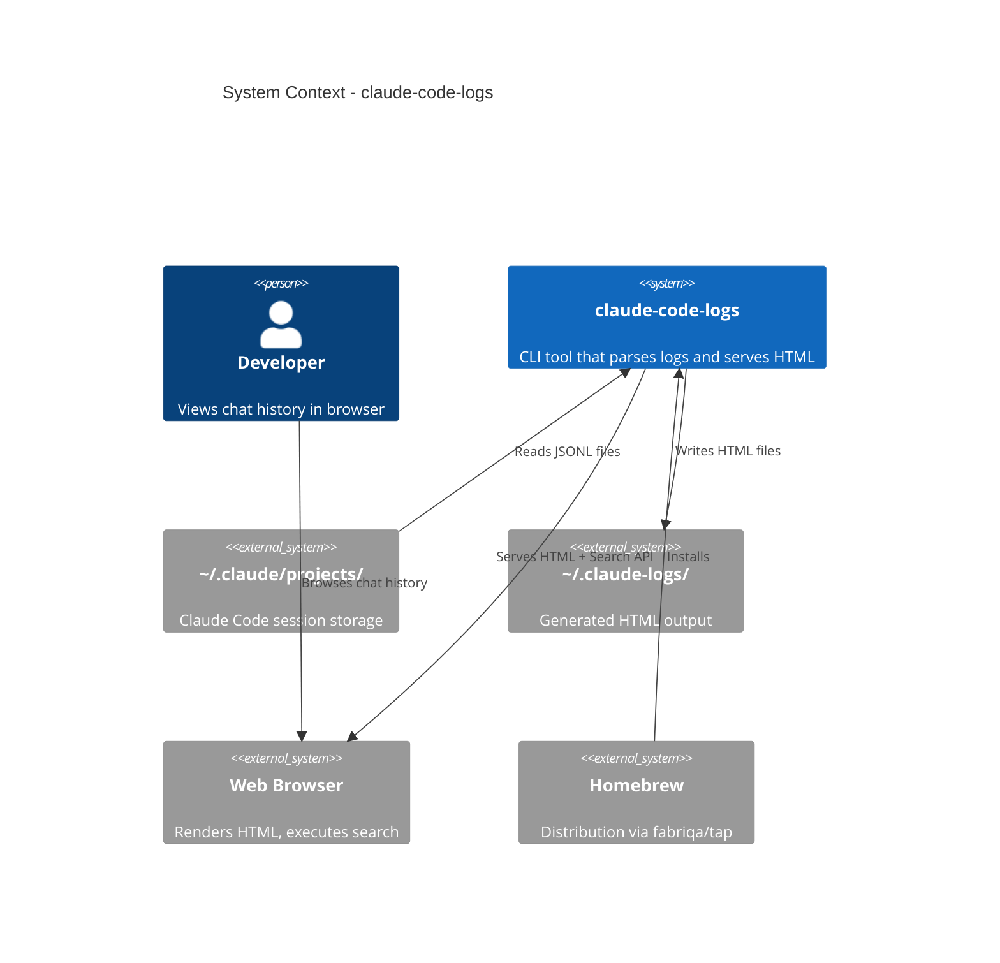

# System Context: chat-log-viewer

## Actors

| Actor | Type | Description |
|-------|------|-------------|
| **Developer** | Human | Primary user - views their Claude Code chat history |
| **Claude Code** | System | Source of JSONL log files in `~/.claude/projects/` |
| **File System** | System | Where logs are read from and HTML is written to |
| **Web Browser** | System | Renders generated HTML, executes client-side search |

## External Systems

| System | Direction | Data | Protocol | Risk |
|--------|-----------|------|----------|------|
| `~/.claude/projects/` | Inbound | JSONL session files | File I/O | Low - local filesystem |
| `~/.claude-logs/` (output) | Outbound | Generated HTML | File I/O | Low - local filesystem |
| Web Browser | Both | HTML + Search queries | HTTP (server mode) | Low - localhost only |
| Homebrew | Distribution | Binary package | brew install | Low |

## Data Flows

### Inbound

| Data | Source | Format | Validation |
|------|--------|--------|------------|
| Session logs | `~/.claude/projects/{project}/*.jsonl` | JSONL | JSON parse, skip malformed |
| File events | Filesystem watcher | OS events | Debounce, filter `.jsonl` |
| Search queries | Browser (POST /api/search) | JSON | Validate query string |

### Outbound

| Data | Destination | Format | Guarantees |
|------|-------------|--------|------------|
| HTML pages | `~/.claude-logs/` | HTML | Atomic write |
| Search results | Browser | JSON | Sync response |
| Static assets | `~/.claude-logs/` | CSS/JS | Embedded in HTML |

## Context Diagram

## Boundaries

### In Scope

- Parse Claude Code JSONL logs
- Generate static HTML with Claude.ai styling
- Serve HTML with search API
- Watch mode for auto-regeneration
- Homebrew distribution via `fabriqa/tap`

### Out of Scope

- Modifying Claude Code logs
- Syncing to cloud services
- User authentication
- Multi-user access
- Windows support (initial release)

## Assumptions

| Assumption | Impact if Wrong |
|------------|-----------------|
| Log format is stable | Parser breaks on Claude Code updates |
| User has read access to `~/.claude` | Tool fails with permission error |
| Sessions fit in memory line-by-line | Large sessions cause OOM |
| localhost:8080 is available | Server fails to start |
