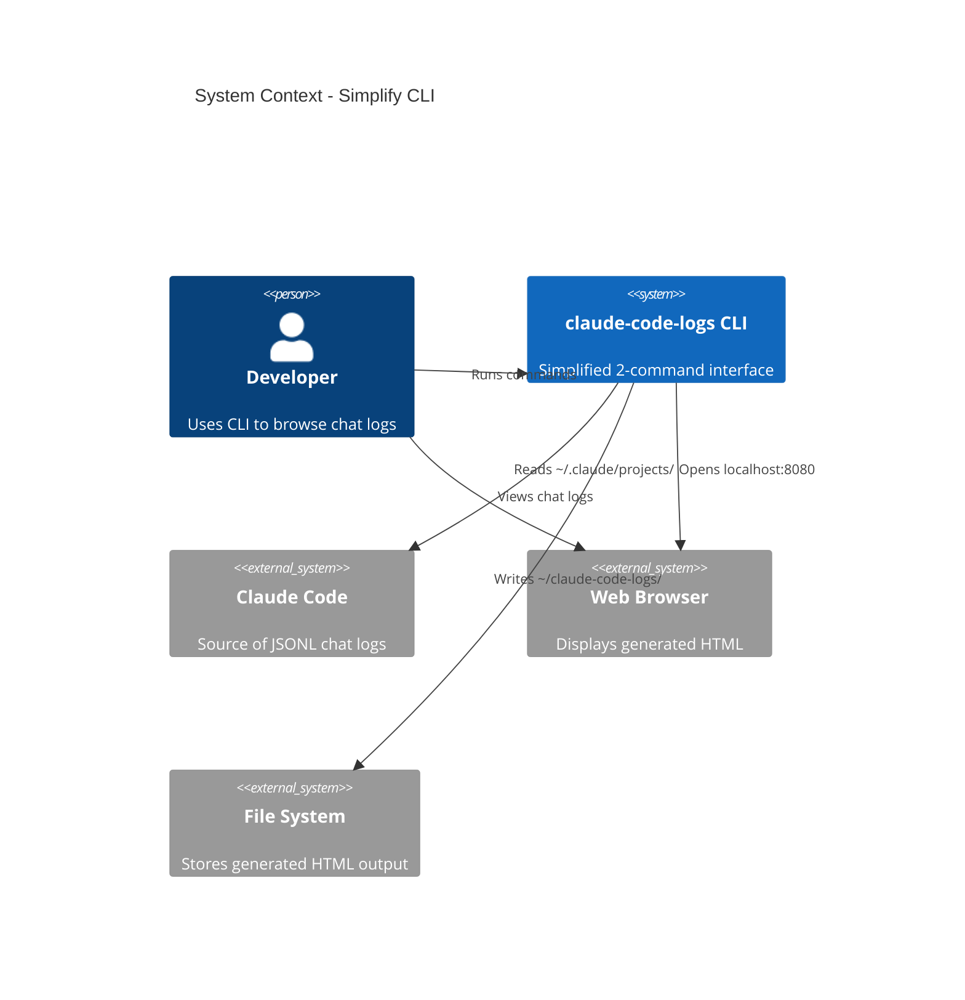

# Simplify CLI - System Context

## System Overview

Refactoring of the existing `claude-code-logs` CLI tool to reduce command complexity. The system boundary remains identical to Intent 001 - this is a CLI interface change only, not a functional change.

## Context Diagram

## Actors

| Actor | Type | Interaction |
|-------|------|-------------|
| Developer | Human | Runs CLI commands, views output in browser |

## External Systems

| System | Purpose | Direction | Data |
|--------|---------|-----------|------|
| Claude Code | Source data | Inbound | JSONL chat logs from `~/.claude/projects/` |
| File System | Storage | Outbound | Generated HTML to `~/claude-code-logs/` |
| Web Browser | Display | Outbound | HTTP responses on localhost |

## Data Flows

### Inbound
- JSONL chat log files from `~/.claude/projects/`
- CLI flags and arguments from user

### Outbound
- Generated HTML files to `~/claude-code-logs/` (new default)
- HTTP responses to browser (serve mode)
- Console output (progress, errors)

## High-Level Constraints

- Must maintain all existing functionality from Intent 001
- Only CLI interface changes, no changes to parser/generator/server internals
- Single binary distribution (Go)
- Cross-platform (macOS, Linux)

## Key NFR Goals

- Zero-config startup: `claude-code-logs serve` just works
- Minimal commands to remember: 2 instead of 4
- Sensible default directory: visible `~/claude-code-logs/` vs hidden `~/.claude-code-logs/`

## Boundary Clarification

### In Scope (Intent 002)
- CLI command structure (`main.go`, `cmd/*.go`)
- Default configuration values
- Help text and documentation
- README updates

### Out of Scope (Intent 002)
- Parser logic (Intent 001, unchanged)
- Generator logic (Intent 001, unchanged)
- Server logic (Intent 001, unchanged)
- Watcher logic (Intent 001, unchanged)
